# device_systems API

API REST académica para administrar **usuarios, dispositivos y préstamos**. Sobre la base de **FastAPI, SQLAlchemy 2, Pydantic v2 y SQLite** (con migraciones Alembic, relaciones y consultas con joins), esta versión añade una **capa de seguridad profesional**: **autenticación OAuth2 con tokens JWT**, **hash de contraseñas con passlib**, **protección de rutas por rol**, **validaciones avanzadas con Pydantic v2**, **middleware personalizado de trazabilidad**, **configuración de CORS** y **rate limiting**.

## Objetivo

Transformar la API en una versión **protegida, controlada y lista para consumir desde un frontend de forma segura**: registrar usuarios con contraseña segura, autenticarlos con JWT, restringir operaciones según rol, limitar peticiones abusivas y añadir trazabilidad a cada request.

## Tecnologías

- Python, FastAPI y Uvicorn.
- SQLAlchemy 2 y SQLite.
- **Alembic** para migraciones de esquema.
- Pydantic v2 y `email-validator`.
- **passlib[bcrypt]** para el hash de contraseñas.
- **python-jose[cryptography]** para firmar y validar tokens JWT.
- **slowapi** para rate limiting.
- **python-dotenv** para la configuración por variables de entorno.

## Ejecutar el proyecto

```bash
python -m venv .venv
source .venv/bin/activate          # Linux/macOS
pip install -r requirements.txt

# 1) Configurar las variables de entorno (secretos y CORS)
cp .env.example .env
# Genera una SECRET_KEY robusta y pégala en .env:
python -c "import secrets; print(secrets.token_urlsafe(32))"

# 2) Crear/actualizar el esquema con Alembic (obligatorio la primera vez)
alembic upgrade head

# 3) Arrancar la API
uvicorn app.main:app --reload
```

> **Variables de entorno**: la configuración de seguridad se lee de `.env` (ver `.env.example`): `SECRET_KEY`, `ALGORITHM`, `ACCESS_TOKEN_EXPIRE_MINUTES` y `CORS_ORIGINS`. El archivo `.env` **no se versiona** (contiene secretos); `.env.example` sí se versiona como plantilla.

> A diferencia de la versión anterior, el esquema **ya no se crea con `create_all`**: ahora lo gestiona Alembic. Debes ejecutar `alembic upgrade head` para crear `device_systems.db` con las tablas `users`, `devices` y `loans`.

Documentación interactiva:

- Swagger UI: [http://127.0.0.1:8000/docs](http://127.0.0.1:8000/docs)
- ReDoc: [http://127.0.0.1:8000/redoc](http://127.0.0.1:8000/redoc)

## Arquitectura

```text
device_systems/
├── app/
│   ├── main.py                          # App FastAPI: CORS, rate limiting, middleware y routers
│   ├── config.py                        # Configuración leída de .env (SECRET_KEY, CORS, JWT)
│   ├── rate_limit.py                    # Limiter compartido de slowapi
│   ├── auth/
│   │   ├── security.py                  # Hash de contraseñas (passlib) y JWT (python-jose)
│   │   ├── auth_service.py              # Registro y autenticación de usuarios
│   │   └── auth_routes.py               # Endpoints /auth/register, /auth/login, /auth/me
│   ├── middlewares/
│   │   └── request_middleware.py        # Trazabilidad: X-Process-Time, X-App-Name, X-Request-ID
│   ├── database/connection.py           # Engine, SessionLocal y Base
│   ├── models/
│   │   ├── user_model.py                # Tabla users (+ hashed_password, + relación loans)
│   │   ├── device_model.py              # Tabla devices (+ relación loans)
│   │   └── loan_model.py                # Tabla loans  (FK a users y devices)
│   ├── schemas/
│   │   ├── user_schema.py               # Contratos Pydantic de usuarios (+ validación password)
│   │   ├── auth_schema.py               # UserRegister, UserLogin, Token, TokenData
│   │   ├── device_schema.py             # Contratos Pydantic de dispositivos
│   │   └── loan_schema.py               # Contratos Pydantic de préstamos (+ detalle)
│   ├── dependencies/
│   │   ├── auth_dependency.py           # OAuth2, get_current_user, require_roles/admin
│   │   └── ...                          # Sesión por petición, filtros y existencia (404)
│   ├── services/                        # Lógica de negocio y consultas SQLAlchemy
│   └── routes/                          # Endpoints HTTP protegidos y documentación OpenAPI
├── alembic/
│   ├── env.py                           # Configurado con Base.metadata y DATABASE_URL
│   └── versions/                        # Migraciones generadas
├── .env.example                         # Plantilla de variables de entorno (sin secretos)
├── alembic.ini
├── requirements.txt
└── README.md
```

El recorrido de una petición es: **cliente → route → service → SQLAlchemy → SQLite**. Los servicios devuelven modelos ORM y los schemas Pydantic (`from_attributes=True`) los convierten a JSON.

## Migraciones con Alembic

Alembic versiona los cambios estructurales de la base de datos. La configuración clave está en `alembic/env.py`:

- `target_metadata = Base.metadata` y se importa el paquete `app.models`, de modo que `--autogenerate` detecta las tablas `users`, `devices` y `loans` y sus claves foráneas.
- `sqlalchemy.url` se toma de `connection.DATABASE_URL` (fuente única de verdad).
- `render_as_batch=True` para permitir cambios de esquema en SQLite (que no soporta `ALTER TABLE` completo).

Comandos usados:

```bash
# Generar la migración inicial a partir de los modelos
alembic revision --autogenerate -m "create users, devices and loans tables"

# Aplicar la migración (crea las tablas)
alembic upgrade head

# Consultar el historial de migraciones
alembic history

# Ver la revisión aplicada actualmente
alembic current
```

## Modelos y relaciones

| Modelo | Tabla     | Campos principales                                                        |
| ------ | --------- | ------------------------------------------------------------------------- |
| User   | `users`   | `id`, `name`, `email` (único), `hashed_password`, `role`, `is_active`, `created_at` |
| Device | `devices` | `id`, `name`, `serial_number` (único), `device_type`, `brand`, `is_available`, `created_at` |
| Loan   | `loans`   | `id`, `user_id` (FK), `device_id` (FK), `loan_date`, `return_date`, `status` |

Relaciones definidas con `relationship()` y `back_populates`:

- **Usuario → préstamos** (One-to-Many): `User.loans` ↔ `Loan.user`.
- **Dispositivo → préstamos** (One-to-Many): `Device.loans` ↔ `Loan.device`.
- **Préstamo → usuario y dispositivo** (Many-to-One): cada `Loan` pertenece a un `User` y a un `Device`, garantizando integridad referencial mediante `ForeignKey`.

## Seguridad y autenticación (OAuth2 + JWT)

### Modelo de usuario y hash de contraseñas

El modelo `User` incorpora el campo `hashed_password` (obligatorio). Las contraseñas **nunca** se guardan ni se muestran en texto plano: se almacenan como **hash bcrypt** mediante passlib y el campo se excluye de todos los modelos de respuesta (`UserResponse`).

`app/auth/security.py` expone las funciones base:

- `get_password_hash(password)` — genera el hash bcrypt.
- `verify_password(plain, hashed)` — verifica una contraseña contra su hash.
- `create_access_token(data)` — firma un JWT con `SECRET_KEY`, `ALGORITHM` y expiración.
- `decode_access_token(token)` — valida y decodifica un JWT (devuelve `None` si es inválido/expirado).

### Validaciones avanzadas con Pydantic v2

Los schemas de `auth_schema.py` usan `Field()` para metadatos y `field_validator` para reglas. La contraseña debe cumplir: **mínimo 8 caracteres, al menos una mayúscula, una minúscula y un número, y sin espacios en blanco**. Un incumplimiento devuelve `422`.

### Endpoints de autenticación (`/auth`)

| Método | Ruta             | Operación                                              | Límite    |
| ------ | ---------------- | ----------------------------------------------------- | --------- |
| POST   | `/auth/register` | Registra un usuario con contraseña segura (`201`)     | 3/min     |
| POST   | `/auth/login`    | Autentica (formulario OAuth2) y devuelve un JWT       | 5/min     |
| GET    | `/auth/me`       | Devuelve el usuario autenticado (sin `hashed_password`) | —       |

`POST /auth/login` usa el flujo **OAuth2 password** (campos `username` = correo y `password`), lo que habilita el botón **Authorize** de Swagger. La respuesta es:

```json
{ "access_token": "<token_generado>", "token_type": "bearer" }
```

Para consumir rutas protegidas se envía el token en la cabecera `Authorization: Bearer <token>`.

### Protección de rutas por rol

Las dependencias de `app/dependencies/auth_dependency.py` protegen las rutas: `get_current_user` (valida el token), `get_current_active_user` (además exige usuario activo), `require_roles(...)` y `require_admin`. Si el token falta o es inválido se responde **401 Unauthorized**; si el rol no está autorizado, **403 Forbidden**.

| Ruta                         | Protección requerida |
| ---------------------------- | -------------------- |
| `GET /users`                 | Usuario autenticado  |
| `GET /users/{user_id}`       | Usuario autenticado  |
| `POST /devices`              | Admin o support      |
| `PUT /devices/{device_id}`   | Admin o support      |
| `PATCH /devices/{device_id}` | Admin o support      |
| `DELETE /devices/{device_id}`| Admin                |
| `POST /loans`                | Usuario autenticado  |
| `PATCH /loans/{loan_id}/return` | Admin o support   |
| `GET /loans/details`         | Admin o support      |

### Middleware personalizado

`RequestContextMiddleware` (`app/middlewares/request_middleware.py`) instrumenta cada petición y agrega cabeceras de trazabilidad a la respuesta:

```
X-App-Name: device_systems
X-Process-Time: 0.0042
X-Request-ID: 8f42e9c1
```

Además mide el tiempo de respuesta, genera o propaga un **correlation ID** (`X-Request-ID`) y registra en el log el método, la ruta y el código de estado de cada request.

### Configuración de CORS

En `main.py` se configura `CORSMiddleware` con los orígenes autorizados (leídos de `CORS_ORIGINS`, por defecto `http://localhost:5173` y `http://localhost:3000`), `allow_credentials=True`, `allow_methods=["*"]` y `allow_headers=["*"]`.

> **¿Por qué no usar `allow_origins=["*"]` con credenciales en producción?** El estándar CORS prohíbe combinar `allow_origins=["*"]` con `allow_credentials=True`: el navegador rechaza la respuesta porque un comodín permitiría que **cualquier** sitio web enviara cookies o cabeceras de autenticación en nombre del usuario, habilitando ataques de tipo CSRF y robo de sesión. En producción se debe **enumerar explícitamente** los dominios del frontend de confianza. El `*` solo es aceptable en desarrollo y sin credenciales.

### Rate limiting

Con **slowapi** se limitan las peticiones por IP. Al superar el límite la API responde **429 Too Many Requests**.

| Endpoint         | Límite               |
| ---------------- | -------------------- |
| `POST /auth/login`    | 5 solicitudes/min |
| `POST /auth/register` | 3 solicitudes/min |
| `GET /users`          | 30 solicitudes/min |
| `POST /loans`         | 10 solicitudes/min |

## Recurso `/users`

> Las rutas de lectura de usuarios requieren **usuario autenticado** (token JWT). El resto del CRUD conserva su comportamiento.

| Método | Ruta                | Operación                       |
| ------ | ------------------- | ------------------------------- |
| GET    | `/users`            | Lista, filtra y ordena usuarios |
| GET    | `/users/{user_id}`  | Consulta un usuario             |
| POST   | `/users`            | Crea un usuario (`201`)         |
| PUT    | `/users/{user_id}`  | Reemplazo completo              |
| PATCH  | `/users/{user_id}`  | Actualización parcial           |
| DELETE | `/users/{user_id}`  | Elimina un usuario (`204`)      |
| GET    | `/users/{user_id}/loans` | Préstamos del usuario (join) |

El DELETE conserva la seguridad simulada del proyecto anterior (`X-API-Key: device-systems-2026`).

## Recurso `/devices`

| Método | Ruta                       | Operación                          |
| ------ | -------------------------- | ---------------------------------- |
| GET    | `/devices`                 | Lista y filtra dispositivos        |
| GET    | `/devices/{device_id}`     | Consulta un dispositivo            |
| POST   | `/devices`                 | Crea un dispositivo (`201`)        |
| PUT    | `/devices/{device_id}`     | Reemplazo completo                 |
| PATCH  | `/devices/{device_id}`     | Actualización parcial              |
| DELETE | `/devices/{device_id}`     | Elimina un dispositivo (`204`)     |
| GET    | `/devices/{device_id}/loans` | Historial de préstamos (join)    |

Filtros del listado (query params): `device_type`, `is_available`, `brand` (parcial) y `search` (busca en nombre, serie y marca con `ilike`). Ejemplos:

```
GET /devices?device_type=laptop
GET /devices?is_available=true
GET /devices?brand=lenovo
GET /devices?search=thinkpad
```

## Recurso `/loans`

| Método | Ruta                      | Operación                                        |
| ------ | ------------------------- | ------------------------------------------------ |
| GET    | `/loans`                  | Lista préstamos con joins y filtros              |
| GET    | `/loans/details`          | Lista préstamos con usuario y dispositivo anidados |
| GET    | `/loans/{loan_id}`        | Consulta un préstamo con información relacionada  |
| POST   | `/loans`                  | Crea un préstamo (`201`)                          |
| PATCH  | `/loans/{loan_id}/return` | Registra la devolución del dispositivo           |

Reglas de negocio:

- **POST /loans**: valida que el usuario y el dispositivo existan, que el dispositivo esté disponible, crea el préstamo (`status="active"`) y marca el dispositivo como **no disponible**.
- **PATCH /loans/{id}/return**: valida que el préstamo exista y no esté ya devuelto, lo marca como `returned`, asigna `return_date` y vuelve a marcar el dispositivo como **disponible**.

## Consultas con joins y filtros

Las consultas combinan varias tablas usando `join()`, `where()`, `ilike()` y `or_()`, con precarga (`joinedload`) para evitar N+1:

```
GET /loans?status=active
GET /loans?user_email=ana@sena.edu.co
GET /loans?device_type=laptop
GET /users/{user_id}/loans
GET /devices/{device_id}/loans
```

Ejemplo de respuesta detallada (`/loans/details`):

```json
[
  {
    "id": 1,
    "status": "active",
    "loan_date": "2026-09-17T11:59:57",
    "return_date": null,
    "user": { "id": 1, "name": "Ana Perez", "email": "ana@sena.edu.co" },
    "device": { "id": 1, "name": "Laptop Lenovo ThinkPad", "serial_number": "LEN-2024-001", "device_type": "laptop" }
  }
]
```

## Manejo de errores

| Caso                                  | Código             |
| ------------------------------------- | ------------------ |
| Registro creado                       | `201 Created`      |
| Consulta / devolución exitosa         | `200 OK`           |
| Eliminación exitosa                   | `204 No Content`   |
| Recurso no encontrado                 | `404 Not Found`    |
| Dato duplicado (email / serie)        | `400 Bad Request`  |
| Token ausente o inválido              | `401 Unauthorized` |
| Rol sin permisos                      | `403 Forbidden`    |
| Regla de negocio incumplida           | `409 Conflict`     |
| Error de validación                   | `422 Unprocessable Entity` |
| Límite de peticiones superado         | `429 Too Many Requests` |

Reglas de negocio que devuelven `409`: intentar prestar un dispositivo **no disponible** e intentar **devolver un préstamo ya devuelto**.

## Pruebas funcionales realizadas

Se verificaron manualmente (Uvicorn + `curl`) los escenarios mínimos de la guía, todos con el código HTTP esperado:

1. Ejecutar migraciones con Alembic (`upgrade head`, `history`, `current`). ✅
2. Crear usuario (`201`). ✅
3. Crear dispositivo (`201`) y serie duplicada (`400`). ✅
4. Crear préstamo (`201`). ✅
5. Intentar prestar un dispositivo no disponible (`409`). ✅
6. Préstamo con usuario/dispositivo inexistente (`404`). ✅
7. Listar préstamos con información de usuario y dispositivo (joins). ✅
8. Filtrar préstamos por estado, email de usuario y tipo de dispositivo. ✅
9. Consultar préstamos de un usuario y el historial de un dispositivo. ✅
10. Devolver un dispositivo (`200`) y verificar que vuelve a estar disponible. ✅
11. Devolver un préstamo ya devuelto (`409`) e inexistente (`404`). ✅
12. Filtro inválido (`422`). ✅

## Pruebas funcionales de seguridad

Escenarios mínimos verificados para la capa de seguridad (Guía 11), todos con el código HTTP esperado:

1. Registro de usuario (`POST /auth/register` → `201`). ✅
2. Registro con contraseña débil (→ `422`). ✅
3. Registro con email duplicado (→ `400`). ✅
4. Login correcto (`POST /auth/login` → `200` + token JWT). ✅
5. Login con contraseña incorrecta (→ `401`). ✅
6. Consulta de `/auth/me` con token válido (→ `200`, sin `hashed_password`). ✅
7. Acceso a ruta protegida sin token (`GET /users` → `401`). ✅
8. Acceso con token inválido (→ `401`). ✅
9. Acceso con usuario sin permisos (`POST /devices` con rol `user` → `403`). ✅
10. Creación de dispositivo con rol permitido (`POST /devices` con rol `admin` → `201`). ✅
11. Eliminación de dispositivo con rol no permitido (`DELETE /devices/{id}` con rol `user` → `403`). ✅
12. Configuración CORS aplicada (orígenes autorizados). ✅
13. Cabeceras generadas por el middleware (`X-App-Name`, `X-Process-Time`, `X-Request-ID`). ✅
14. Activación de rate limiting (`POST /auth/login` → `429` al exceder 5/min). ✅
15. Verificación de Swagger/OpenAPI (esquema OAuth2 y rutas protegidas). ✅

## Evidencias de funcionamiento

Las capturas del CRUD de usuarios de la versión anterior se conservan en `docs/`. Para esta entrega deben agregarse a `docs/` las siguientes evidencias (referenciadas aquí):

### Migraciones con Alembic

Generación de la migración a partir de los modelos (`alembic revision --autogenerate`):

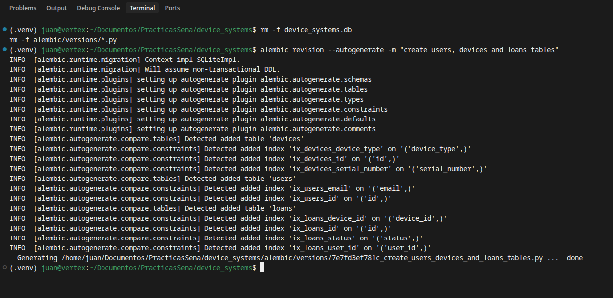

Aplicación de la migración (`alembic upgrade head`):

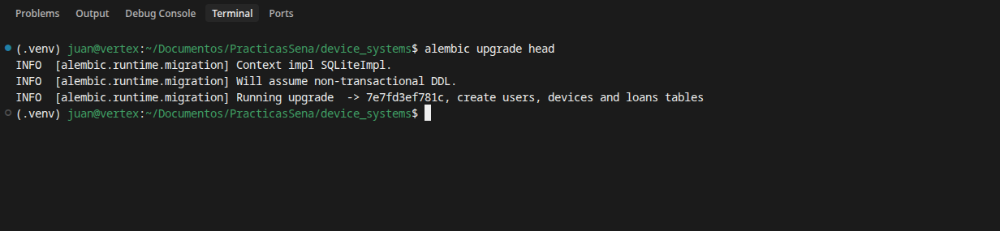

Historial de migraciones (`alembic history` / `alembic current`):

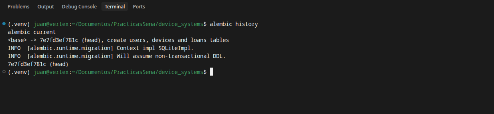

Estructura de las tablas generadas (`users`, `devices`, `loans`):

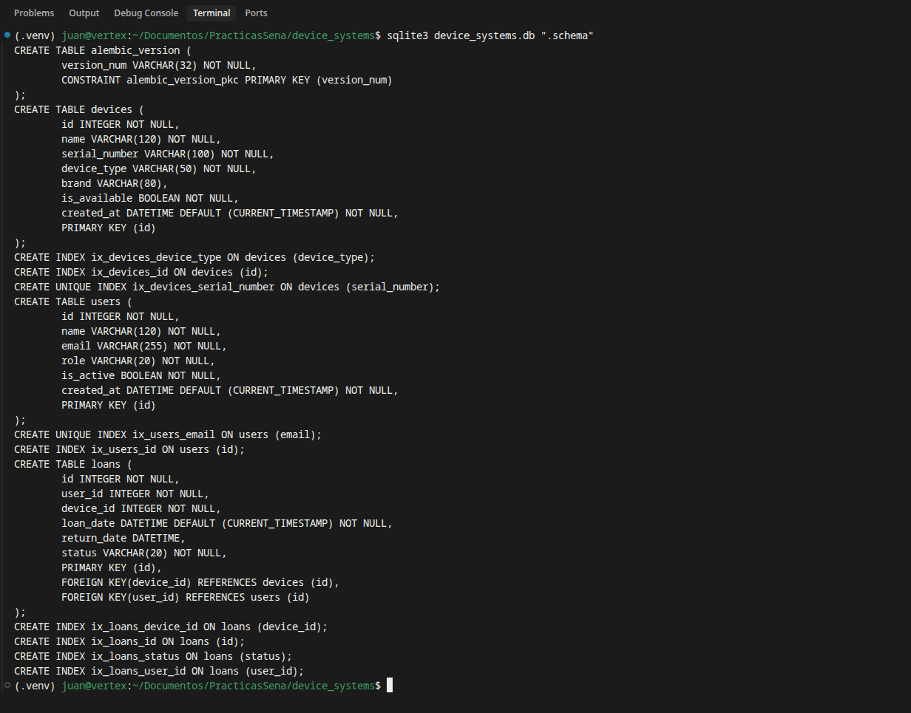

### Seguridad, autenticación y middleware (Guía 11)

Evidencias a agregar en `docs/` para esta entrega (referenciadas aquí):

| Evidencia                                   | Qué demuestra                                              | Captura                                                     |
| ------------------------------------------- | --------------------------------------------------------- | ---------------------------------------------------------- |
| Estructura del proyecto                     | Árbol con `auth/`, `middlewares/`, `config.py`            | [estructura-proyecto.png](docs/estructura-proyecto.png)     |
| Migración Alembic aplicada                  | `hashed_password` añadido a `users`                       | [alembic-auth.png](docs/alembic-auth.png)                   |
| Registro de usuario                         | `POST /auth/register` → `201` (sin contraseña en respuesta) | [auth-register.png](docs/auth-register.png)               |
| Login y token generado                      | `POST /auth/login` → `access_token` + `token_type`       | [auth-login.png](docs/auth-login.png)                       |
| Perfil autenticado                          | `GET /auth/me` → datos del usuario (sin hash)            | [auth-me.png](docs/auth-me.png)                             |
| Acceso sin token                            | Ruta protegida → `401 Unauthorized`                       | [acceso-sin-token.png](docs/acceso-sin-token.png)           |
| Acceso con rol no permitido                 | Operación de rol → `403 Forbidden`                        | [acceso-rol-no-permitido.png](docs/acceso-rol-no-permitido.png) |
| Swagger con OAuth2                           | Botón **Authorize** y rutas protegidas                    | [swagger-oauth2.png](docs/swagger-oauth2.png)               |
| Cabeceras del middleware                    | `X-App-Name`, `X-Process-Time`, `X-Request-ID`           | [middleware-headers.png](docs/middleware-headers.png)       |
| Prueba de rate limiting                     | `429 Too Many Requests` al exceder el límite             | [rate-limit.png](docs/rate-limit.png)                       |

> Sugerencia para capturar el token y las cabeceras: usa Swagger (`/docs`) o Thunder Client/Postman y muestra la pestaña de **Headers** de la respuesta.

### Swagger UI y ReDoc

Swagger permite probar los endpoints desde `/docs`, organizados por tags **Auth**, **Users**, **Devices**, **Loans** y **Security**, incluyendo el esquema **OAuth2**.

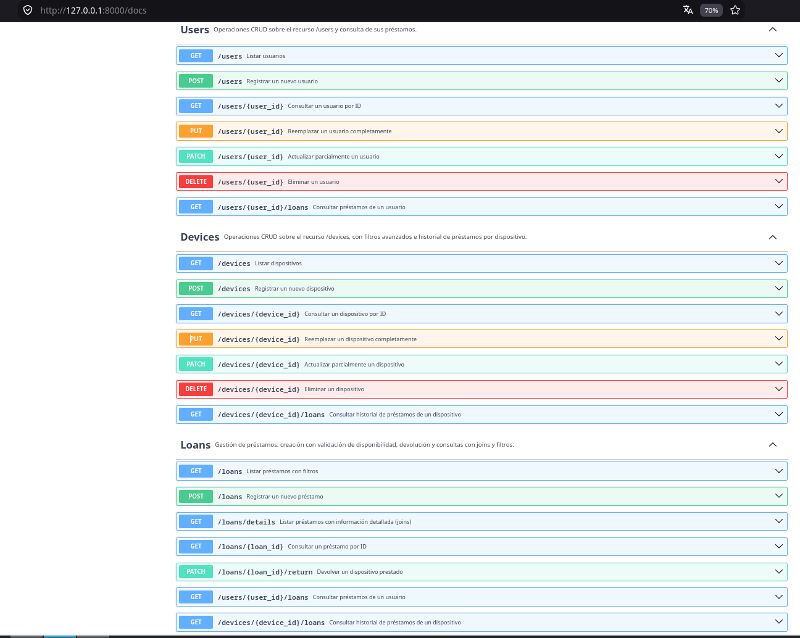


### CRUD del recurso users (evidencias existentes)

| Evidencia             | Captura                                       |
| --------------------- | --------------------------------------------- |
| Listado y filtros     | [get-users.png](docs/get-users.png)           |
| Consulta por ID       | [get-user-by-id.png](docs/get-user-by-id.png) |
| Creación              | [post-users.png](docs/post-users.png)         |
| Reemplazo completo    | [put-users.png](docs/put-users.png)           |
| Actualización parcial | [patch-users.png](docs/patch-users.png)       |
| Eliminación           | [delete-users.png](docs/delete-users.png)     |
| Validaciones          | [validaciones.png](docs/validaciones.png)     |

### Dispositivos, préstamos, joins y filtros

| Evidencia                                         | Qué demuestra                                            | Captura                                             |
| ------------------------------------------------- | ------------------------------------------------------- | -------------------------------------------------- |
| Crear dispositivo                                 | `POST /devices` con respuesta `201`                     | [post-device.png](docs/post-device.png)             |
| Crear préstamo                                    | `POST /loans` con respuesta `201` (estado `active`)     | [post-loan.png](docs/post-loan.png)                 |
| Prestar dispositivo no disponible                 | `POST /loans` con respuesta `409`                       | [loan-no-disponible.png](docs/loan-no-disponible.png) |
| Consulta con joins                                | `GET /loans/details` con usuario y dispositivo anidados | [loans-details.png](docs/loans-details.png)         |
| Filtros aplicados                                 | `GET /loans?status=active` o `/devices?search=...`      | [loans-filtros.png](docs/loans-filtros.png)         |
| Devolución de dispositivo                         | `PATCH /loans/{id}/return` con respuesta `200`          | [loan-return.png](docs/loan-return.png)             |
| Dispositivo vuelve a estar disponible             | `GET /devices/{id}` con `is_available: true`            | [device-disponible.png](docs/device-disponible.png) |

Vista previa:

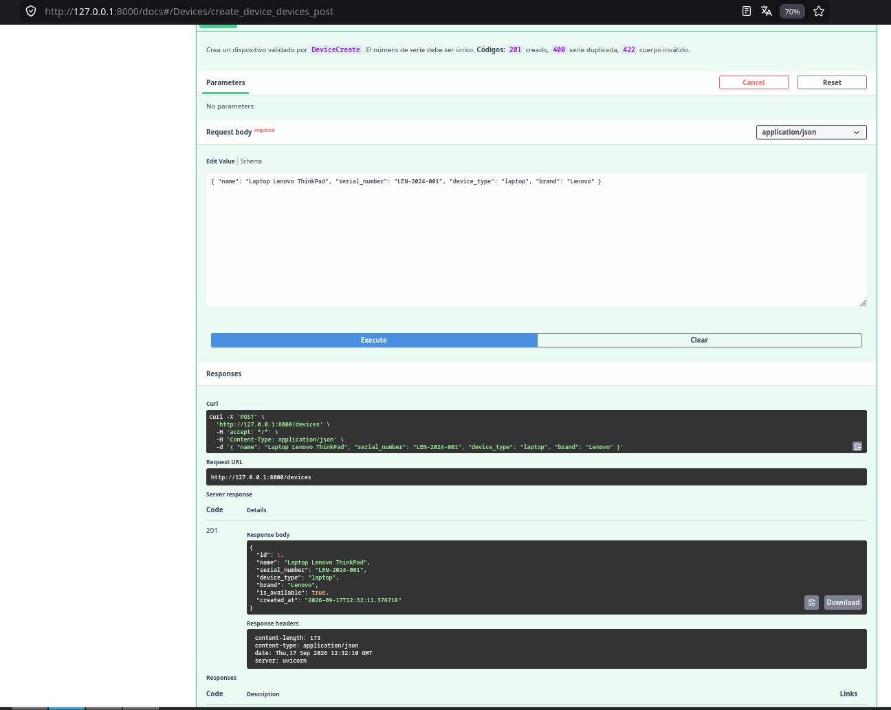
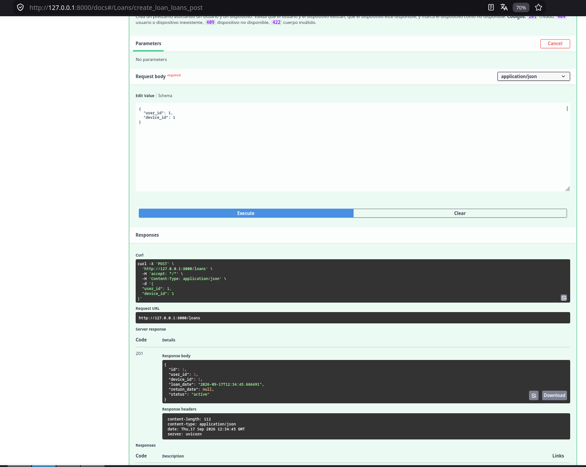
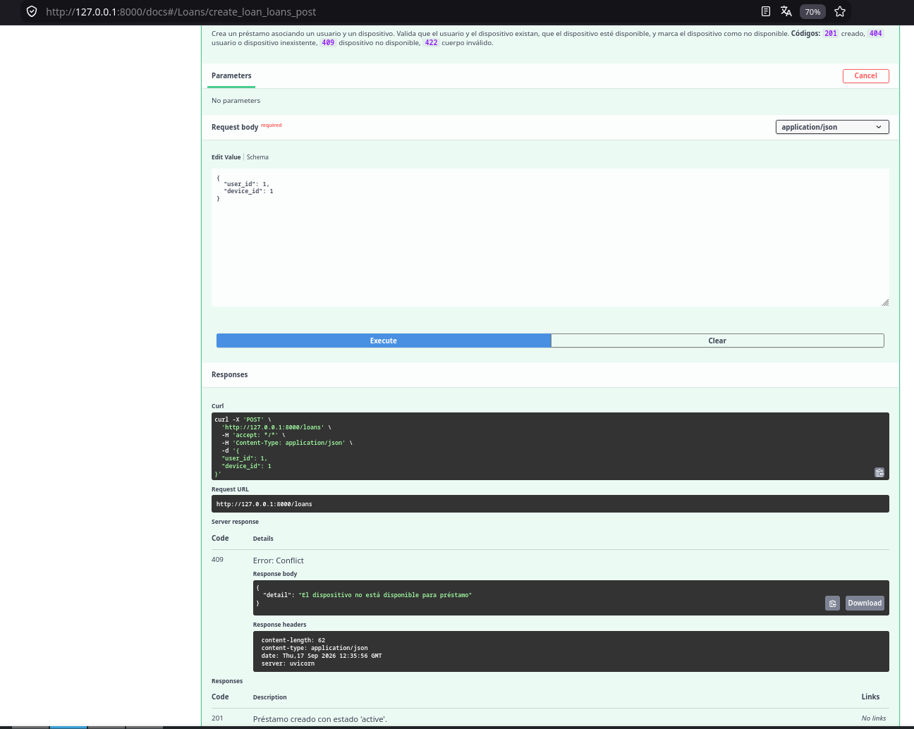
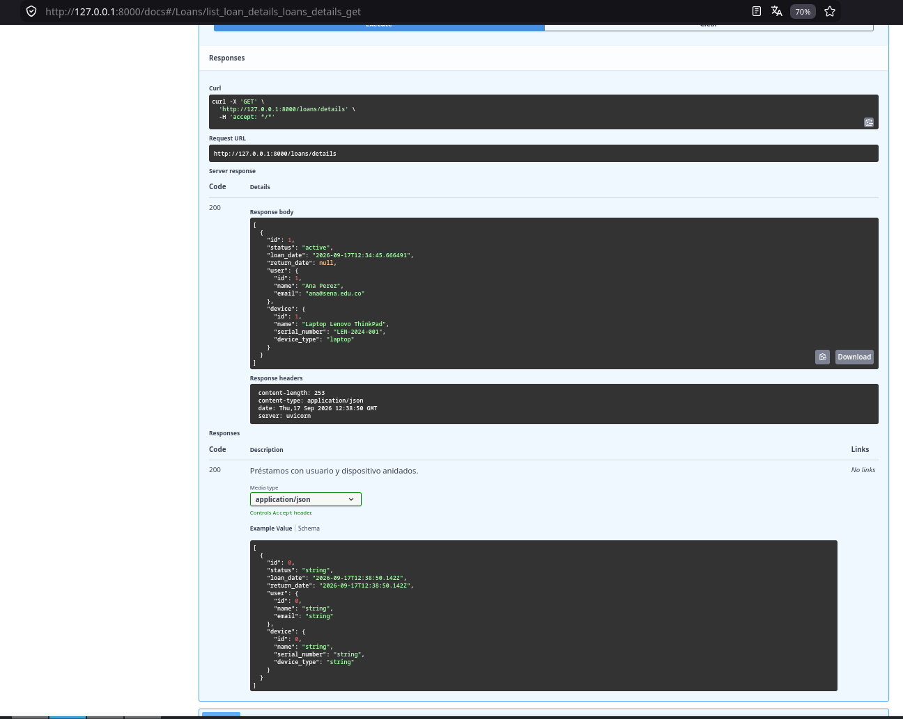
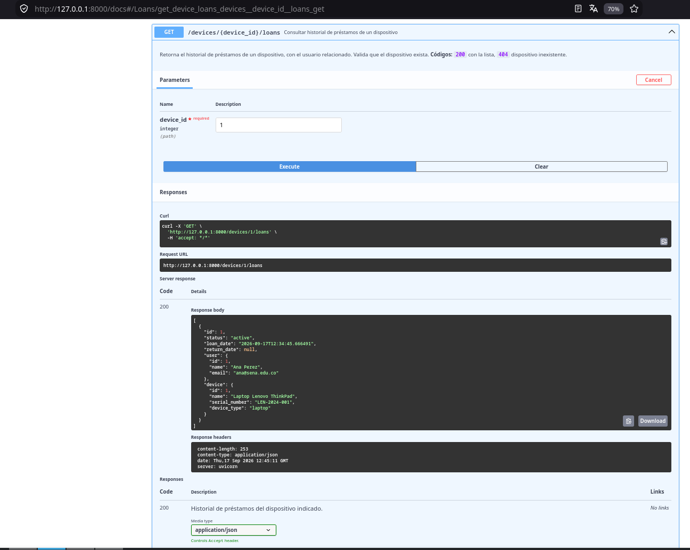
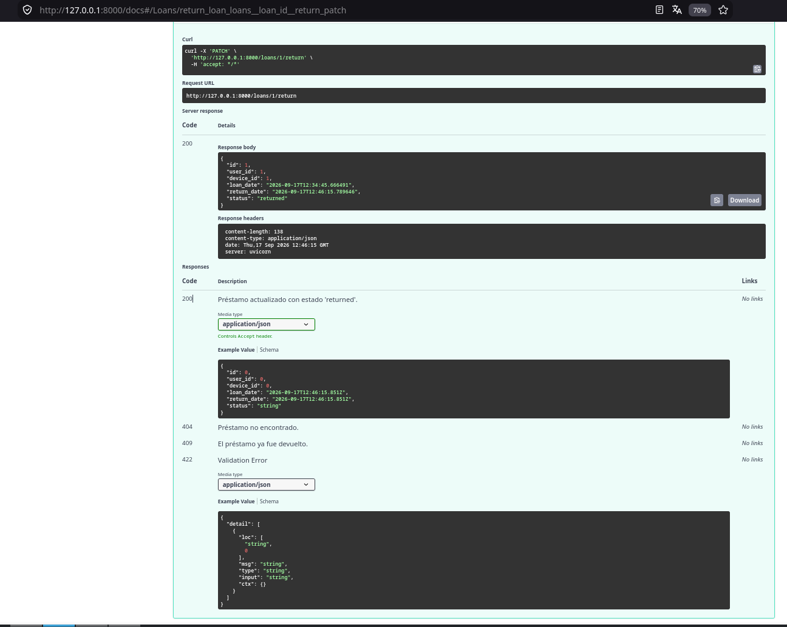
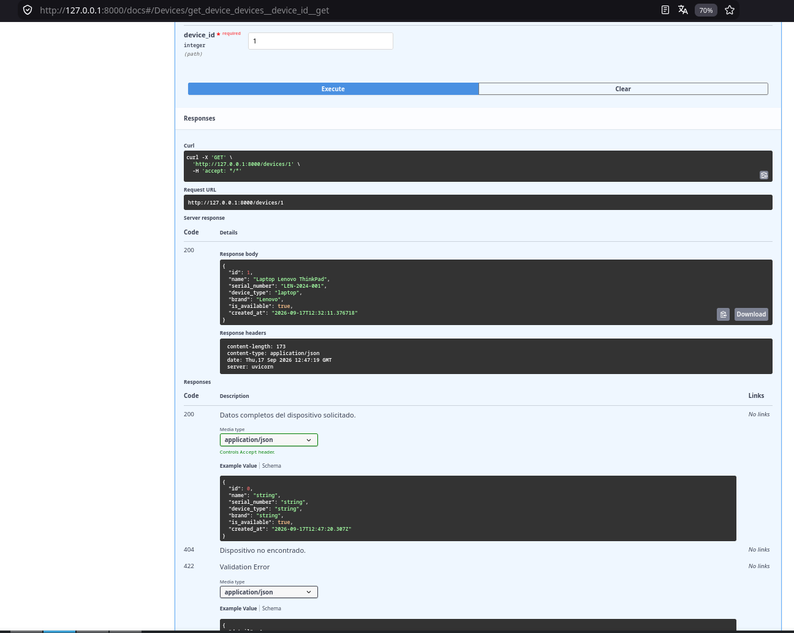

## Reflexión

Las **migraciones** permiten evolucionar el esquema de forma controlada y versionada, sin perder datos ni depender de `create_all`. Las **relaciones** con claves foráneas y `relationship()` garantizan integridad referencial y modelan el dominio real (un usuario tiene muchos préstamos; un dispositivo acumula un historial). Las **consultas con joins y filtros** convierten la API en una herramienta de análisis: no solo almacena datos, sino que responde preguntas que cruzan varias tablas.

### Sobre la seguridad en APIs REST

Una API expuesta a un frontend o a terceros no puede confiar en el cliente: **cualquier** petición puede ser maliciosa. Por eso la seguridad se construye en capas complementarias. El **hash de contraseñas** (bcrypt) asegura que, incluso si la base de datos se filtra, las credenciales no quedan expuestas en texto plano. La **autenticación con JWT** permite validar la identidad del cliente en cada petición sin mantener estado en el servidor, y la **autorización por roles** limita qué puede hacer cada usuario (principio de mínimo privilegio: un `user` no borra dispositivos). El **rate limiting** protege contra abuso y ataques de fuerza bruta sobre el login, respondiendo `429`. **CORS** controla qué orígenes del navegador pueden consumir la API —y por eso nunca se combina `*` con credenciales en producción—. Finalmente, el **middleware de trazabilidad** aporta observabilidad (tiempo de respuesta y `X-Request-ID`) para auditar y depurar. En conjunto, estas medidas transforman un CRUD funcional en una API **profesional y defendible**, lista para producción.
