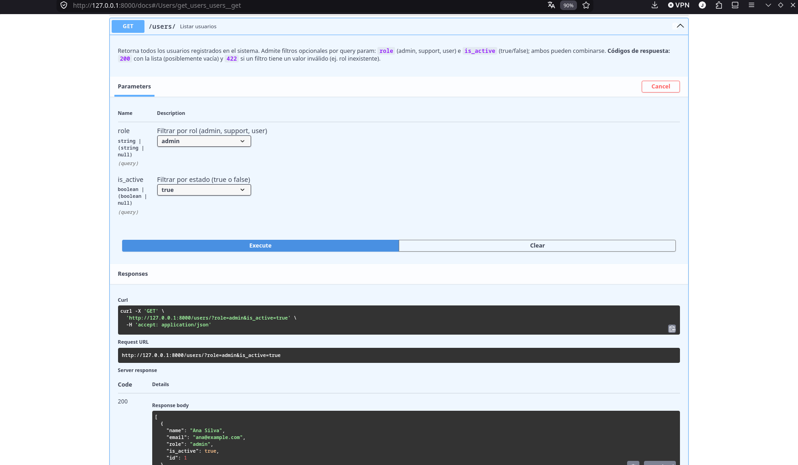
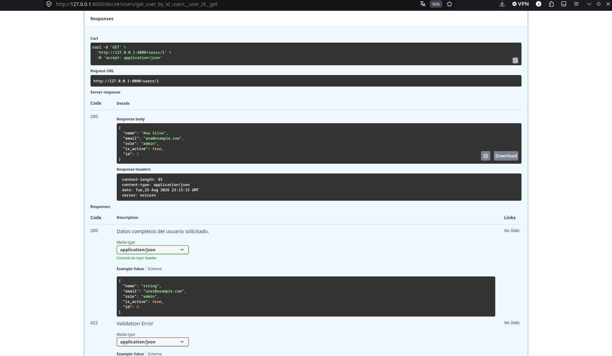
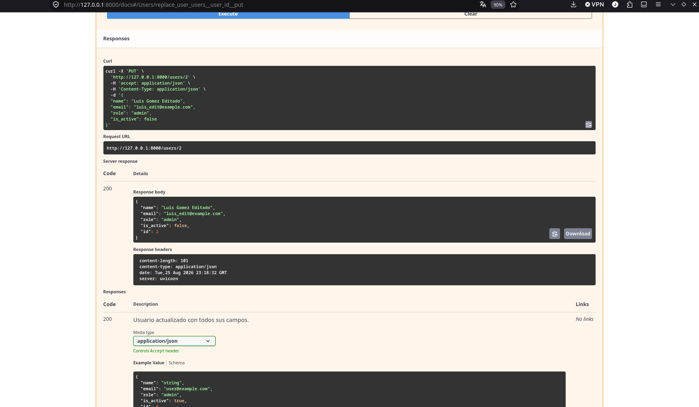
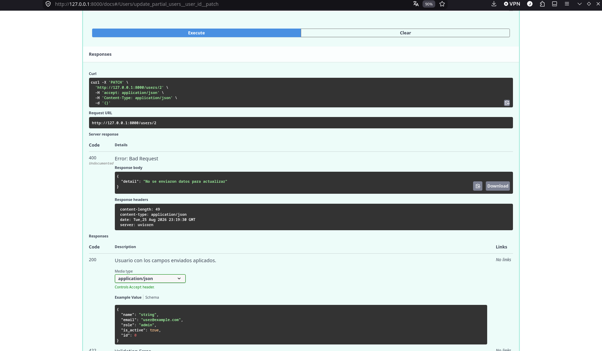
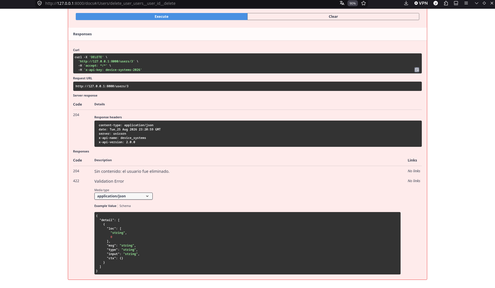

# Device Systems API

 

## Nombre y Descripción

**device_systems API v2.0.0** es una API REST construida con FastAPI para la gestión de usuarios del sistema de dispositivos. Permite listar, filtrar, consultar, registrar, reemplazar, actualizar parcialmente y eliminar usuarios, aplicando validaciones estrictas mediante Pydantic v2 y una arquitectura profesional por capas (`routes → services → data`).

## Documentación Interactiva

Al levantar el servidor, FastAPI genera automáticamente la documentación OpenAPI:

- **Swagger UI:** [http://127.0.0.1:8000/docs](http://127.0.0.1:8000/docs)
- **Redoc:** [http://127.0.0.1:8000/redoc](http://127.0.0.1:8000/redoc)


## Instalación de Dependencias

Crea y activa un entorno virtual:

```bash
python -m venv .venv
source .venv/bin/activate   # Linux/Mac
# .venv\Scripts\activate    # Windows
```

Con **uv** como gestor de paquetes:

```bash
uv pip install -r requirements.txt
```

O con **pip** tradicional:

```bash
pip install -r requirements.txt
```

Dependencias declaradas en `requirements.txt`: `fastapi`, `uvicorn[standard]`, `pydantic[email]`.

## Ejecución del Servidor

```bash
uvicorn app.main:app --reload
```

Alternativa moderna con el CLI de FastAPI:

```bash
fastapi dev app/main.py
```


## Arquitectura del Proyecto (por capas)

```text
device_systems/
├── app/
│   ├── main.py                     # Punto de entrada: metadatos OpenAPI + inclusión de routers
│   ├── routes/
│   │   └── user_routes.py          # Capa HTTP: endpoints documentados, delegan en servicios
│   ├── schemas/
│   │   └── user_schema.py          # Modelos Pydantic (UserCreate, UserResponse, UserUpdate, UserPatch)
│   ├── services/
│   │   └── user_service.py         # Lógica de negocio: filtros, reglas de correo, CRUD
│   ├── dependencies/
│   │   └── user_dependencies.py    # Dependencias reutilizables (filtros, 404, API key, config)
│   └── data/
│       └── users_db.py             # Capa de datos: base simulada en memoria
├── requirements.txt                # Dependencias del proyecto
└── README.md                       # Documentación
```


| Capa            | Responsabilidad                                                                                                                                                                   |
| --------------- | --------------------------------------------------------------------------------------------------------------------------------------------------------------------------------- |
| `routes/`       | Recibir peticiones HTTP, documentar cada operación (summary/description), traducir errores de negocio a códigos de estado y devolver respuestas/cabeceras. Sin lógica de negocio. |
| `schemas/`      | Contratos de datos con Pydantic: entrada completa (`UserCreate`/`UserUpdate`), entrada parcial (`UserPatch`) y salida (`UserResponse`).                                           |
| `services/`     | Lógica de negocio reutilizable: filtrar, buscar, validar unicidad de correos y persistir cambios. No conoce HTTP.                                                                 |
| `dependencies/` | Componentes inyectables de FastAPI (`Depends`): filtros por query, resolución de usuario con 404 automático, verificación de `X-API-Key` y configuración general.                 |
| `data/`         | Persistencia simulada (lista en memoria). Único punto que cambiaría al migrar a una base de datos real.                                                                           |


## Tabla Completa de Endpoints


| Método | Ruta               | Parámetros                                           | Éxito                                         | Errores                                                                             | Descripción                                          |
| ------ | ------------------ | ---------------------------------------------------- | --------------------------------------------- | ----------------------------------------------------------------------------------- | ---------------------------------------------------- |
| GET    | `/users`           | Query: `role`, `is_active`                           | `200`                                         | `422` valor de filtro inválido                                                      | Lista todos los usuarios; admite filtros combinables |
| GET    | `/users/{user_id}` | Path: `user_id` (int)                                | `200`                                         | `404` no existe · `422` ID no entero                                                | Consulta un usuario específico                       |
| POST   | `/users`           | Body: JSON (`UserCreate`)                            | `201` + headers `X-App-Name`, `X-API-Version` | `400` correo duplicado · `422` validación Pydantic                                  | Registra un nuevo usuario con ID autogenerado        |
| PUT    | `/users/{user_id}` | Path: `user_id` · Body: JSON completo (`UserUpdate`) | `200`                                         | `400` correo en uso por otro usuario · `404` no existe · `422` cuerpo incompleto    | Reemplazo total de los campos editables              |
| PATCH  | `/users/{user_id}` | Path: `user_id` · Body: JSON parcial (`UserPatch`)   | `200`                                         | `400` body vacío `{}` o correo duplicado · `404` no existe · `422` campos inválidos | Actualización parcial (solo campos enviados)         |
| DELETE | `/users/{user_id}` | Path: `user_id` · Header: `X-API-Key`                | `204` sin contenido                           | `401` falta header · `403` llave inválida · `404` no existe                         | Elimina un usuario (operación protegida)             |


### Autenticación Simulada (X-API-Key)

El endpoint **DELETE** requiere el encabezado de seguridad simulada:

```
X-API-Key: device-systems-2026
```

- Sin el encabezado → `401 Unauthorized`
- Con una llave incorrecta → `403 Forbidden`
- Con la llave correcta → `204 No Content`


## Dependency Injection (Depends y Annotated)

La capa `dependencies/` centraliza componentes inyectables que FastAPI resuelve automáticamente en cada petición:

```python
from typing import Annotated
from fastapi import Depends

def get_existing_user(user_id: int) -> dict:
    user = user_service.get_user_by_id(user_id)
    if user is None:
        raise HTTPException(status_code=404, detail="Usuario no encontrado")
    return user

UserDep = Annotated[dict, Depends(get_existing_user)]
```

En la ruta basta declarar el parámetro tipado:

```python
@router.get("/{user_id}", response_model=UserResponse)
def get_user_by_id(user: UserDep):
    return user
```

Ventajas aplicadas en el proyecto:

- `get_existing_user` **→** `UserDep`**:** elimina duplicación del manejo 404; usada por GET/PUT/PATCH/DELETE.
- `user_filters` **→** `FiltersDep`**:** agrupa query params de filtrado del GET general.
- `verify_api_key` **→** `ApiKeyDep`**:** seguridad simulada por encabezado; protege DELETE (401/403).
- `get_api_config` **→** `ConfigDep`**:** configura cabeceras informativas desde un punto único.

`Annotated` mantiene juntos el tipo y su proveedor, haciendo las firmas legibles y compatibles con herramientas estáticas.

## Manejo de Errores (negocio → HTTP)

Las reglas de negocio lanzan excepciones Python en `services/`; la capa `routes/` las traduce a respuestas HTTP coherentes:


| Error de negocio (service)                 | Excepción                                            | Traducción HTTP (route)    |
| ------------------------------------------ | ---------------------------------------------------- | -------------------------- |
| Correo ya registrado (POST)                | `ValueError`                                         | `400 Bad Request`          |
| Correo en uso por otro usuario (PUT/PATCH) | `ValueError`                                         | `400 Bad Request`          |
| PATCH sin campos para actualizar           | `ValueError("No se enviaron datos para actualizar")` | `400 Bad Request`          |
| Usuario inexistente                        | Controlado por `get_existing_user` (dependencia)     | `404 Not Found`            |
| Cuerpo inválido / campos faltantes         | Validación automática de Pydantic                    | `422 Unprocessable Entity` |


Este desacoplamiento permite que los servicios sean testeables sin HTTP y que las rutas mantengan una sola responsabilidad.

## Evidencias y Capturas de Swagger UI

- Vista general de Swagger UI con los metadatos de la API (título, versión 2.0.0, contacto, licencia).
- Redoc renderizando la misma especificación OpenAPI.
- GET general y filtrado (`role=admin`, `is_active=true`).
- GET por ID existente y error 404 con ID inexistente.
- POST exitoso (201) verificando headers `X-App-Name` y `X-API-Version`.
- POST con errores: nombre corto (422) y correo duplicado (400).
- PUT completo exitoso y conflicto de correo (400).
- PATCH parcial exitoso y body vacío `{}` generando 400.
- DELETE con 401 (sin key), 403 (key inválida) y 204 (con key correcta).

Marcadores de posición:










## Reflexión sobre el uso de FastAPI

Trabajar con FastAPI permitió evolucionar el proyecto de un prototipo monolítico a una arquitectura por capas sin fricción: las rutas quedaron delgadas, la lógica vive en servicios testeables y los datos están aislados en su propia capa. Pydantic v2 valida entradas completas (PUT) y parciales (PATCH) con el mismo esfuerzo; `Annotated` + `Depends` convirtieron la verificación de existencia, los filtros y la seguridad simulada en componentes reutilizables; y la documentación OpenAPI se genera sola a partir de los metadatos globales y de cada endpoint, manteniendo `/docs` siempre sincronizada con el código.