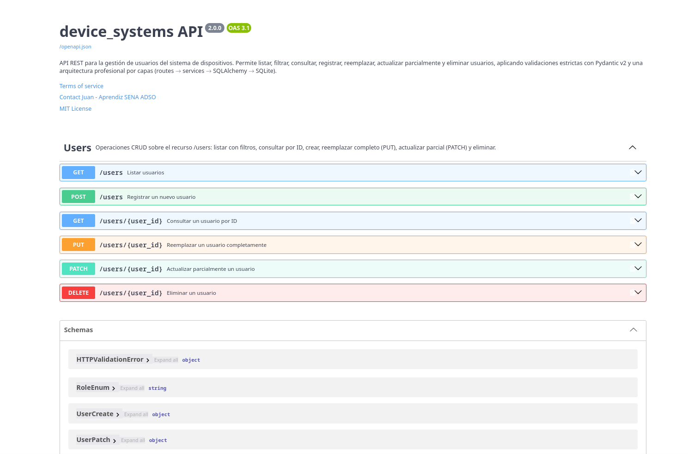
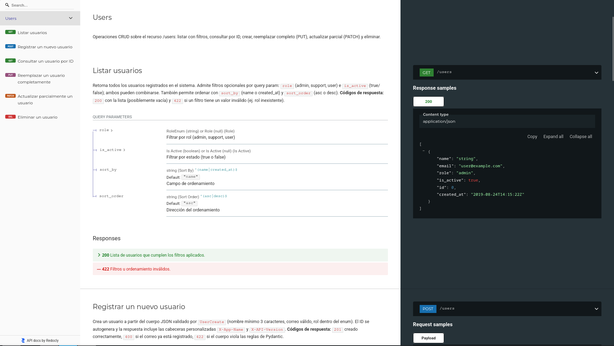
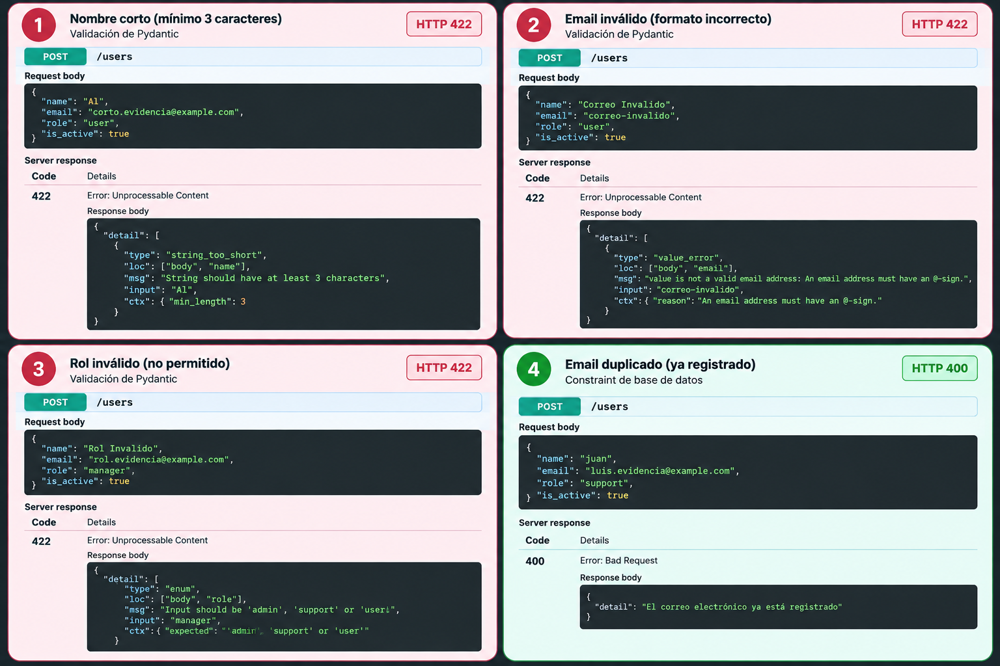

# device_systems API

API REST académica para administrar usuarios del sistema de dispositivos. Esta evolución reemplaza la lista temporal en memoria por persistencia real con **FastAPI, SQLAlchemy 2, Pydantic v2 y SQLite**.

## Objetivo

Demostrar una API REST organizada por capas que persiste usuarios en SQLite, aplica validaciones de entrada y expone un CRUD documentado mediante OpenAPI.

## Tecnologías

- Python, FastAPI y Uvicorn.
- SQLAlchemy 2 y SQLite.
- Pydantic v2 y `email-validator`.

## Ejecutar el proyecto

```bash
python -m venv .venv
source .venv/bin/activate  # Linux/macOS
pip install -r requirements.txt
uvicorn app.main:app --reload
```

La aplicación crea automáticamente `device_systems.db` en la raíz del proyecto al iniciarse. Consulta la documentación interactiva en:

- Swagger UI: [http://127.0.0.1:8000/docs](http://127.0.0.1:8000/docs)
- ReDoc: [http://127.0.0.1:8000/redoc](http://127.0.0.1:8000/redoc)


## Arquitectura

```text
app/
├── main.py                         # App FastAPI y creación de tablas al iniciar
├── database/connection.py           # Engine, SessionLocal y Base
├── models/user_model.py             # Modelo ORM de SQLAlchemy (tabla users)
├── schemas/user_schema.py           # Contratos y validaciones Pydantic
├── dependencies/database_dependency.py # Sesión por petición, cerrada garantizadamente
├── dependencies/user_dependencies.py   # Filtros, 404, API key y configuración
├── services/user_service.py         # CRUD y consultas SQLAlchemy
└── routes/user_routes.py            # Endpoints HTTP y documentación OpenAPI
```

El recorrido de una petición es: **cliente → route → service → SQLAlchemy → SQLite**. El servicio devuelve modelos ORM; `UserResponse` los convierte a JSON mediante Pydantic (`from_attributes=True`).

## Base de datos y SQLAlchemy

La URL es `sqlite:///./device_systems.db`. `connection.py` define:

- `engine`: conexión configurada para SQLite.
- `SessionLocal`: fábrica de sesiones independientes por petición.
- `Base`: clase declarativa de la que heredan los modelos.
- `get_db`: dependencia que entrega la sesión y la cierra con `finally`, incluso ante errores.

La tabla `users` tiene `id` (entero, PK e índice), `name` (texto obligatorio), `email` (texto obligatorio, único e indexado), `role` (texto obligatorio), `is_active` (booleano, `True` por defecto) y `created_at` (fecha/hora automática). La restricción única de `email` se confirma en SQLite; un `IntegrityError` se revierte y se expone como `400`, sin filtrar detalles internos.

## Schemas y validaciones

El modelo SQLAlchemy describe cómo se guarda una fila; los schemas Pydantic describen y validan el JSON HTTP:

- `UserCreate`: cuerpo de creación; todos los datos editables requeridos y `is_active=True` por defecto.
- `UserUpdate`: cuerpo completo obligatorio para `PUT`.
- `UserPatch`: todos los campos opcionales para `PATCH`.
- `UserResponse`: salida con `id` y `created_at`.

`name` exige mínimo 3 caracteres; `email` usa `EmailStr`/`email-validator`; `role` admite únicamente `admin`, `support` o `user`; `is_active` es booleano. Los datos inválidos se devuelven como `422`.

## Recurso `/users`


| Método | Ruta               | Operación                       |
| ------ | ------------------ | ------------------------------- |
| GET    | `/users`           | Lista, filtra y ordena usuarios |
| GET    | `/users/{user_id}` | Consulta un usuario             |
| POST   | `/users`           | Crea un usuario (`201`)         |
| PUT    | `/users/{user_id}` | Reemplazo completo              |
| PATCH  | `/users/{user_id}` | Actualización parcial           |
| DELETE | `/users/{user_id}` | Elimina un usuario (`204`)      |


El listado acepta `role`, `is_active`, `sort_by` (`name` o `created_at`) y `sort_order` (`asc` o `desc`). El DELETE conserva la seguridad simulada del proyecto anterior y requiere `X-API-Key: device-systems-2026`.

Errores principales: `404` para usuario inexistente, `400` para email duplicado o PATCH vacío, `401/403` para la llave de DELETE y `422` para validación de path, query o body.

## Pruebas realizadas

Se verificaron manualmente los seis endpoints mediante Uvicorn: creación, email duplicado, listado, consulta por ID, filtros, ordenamiento, PUT, PATCH, DELETE, consulta de usuario eliminado y validaciones de nombre, email y rol. Las capturas de esas pruebas se conservan en `docs/`.

## Ejemplo de creación

```json
{
  "name": "Ana Silva",
  "email": "ana@example.com",
  "role": "admin",
  "is_active": true
}
```


## Evidencias de funcionamiento

Las capturas se guardan en la carpeta `docs/`.

### Swagger UI y ReDoc

Swagger permite probar los endpoints directamente desde `/docs`; ReDoc presenta la misma especificación como documentación de consulta.





### CRUD del recurso users


| Evidencia             | Qué debe demostrar                                          | Captura                                       |
| --------------------- | ----------------------------------------------------------- | --------------------------------------------- |
| Listado y filtros     | `GET /users`, filtro por rol o estado y ordenamiento        | [get-users.png](docs/get-users.png)           |
| Consulta por ID       | Usuario existente y respuesta `404` para un ID inexistente  | [get-user-by-id.png](docs/get-user-by-id.png) |
| Creación              | `POST /users`, respuesta `201` y usuario creado             | [post-users.png](docs/post-users.png)         |
| Reemplazo completo    | `PUT /users/{user_id}` con todos los campos                 | [put-users.png](docs/put-users.png)           |
| Actualización parcial | `PATCH /users/{user_id}` con solo los campos necesarios     | [patch-users.png](docs/patch-users.png)       |
| Eliminación           | `DELETE /users/{user_id}` con `X-API-Key` y respuesta `204` | [delete-users.png](docs/delete-users.png)     |


### Validaciones y errores

Esta captura debe mostrar al menos un nombre menor de tres caracteres, email inválido, rol no permitido o correo duplicado. FastAPI responde con `422` para validaciones de datos y `400` para email duplicado.



No se añadió Alembic: la actividad solicita la inicialización de SQLite, pero no define una fase de migraciones. Para cambios futuros de esquema en un entorno con datos ya desplegados, Alembic sería el siguiente paso.
